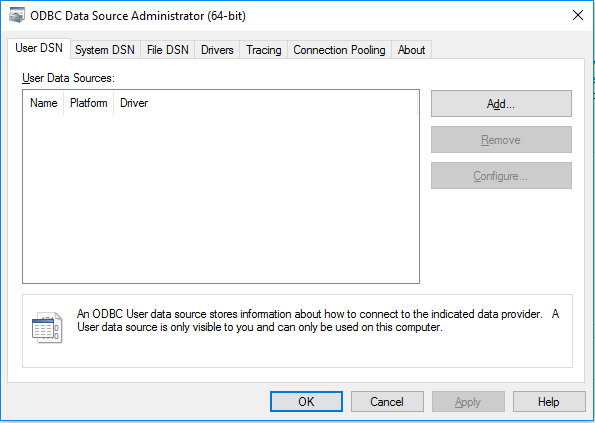
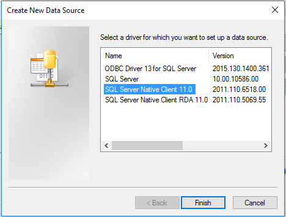
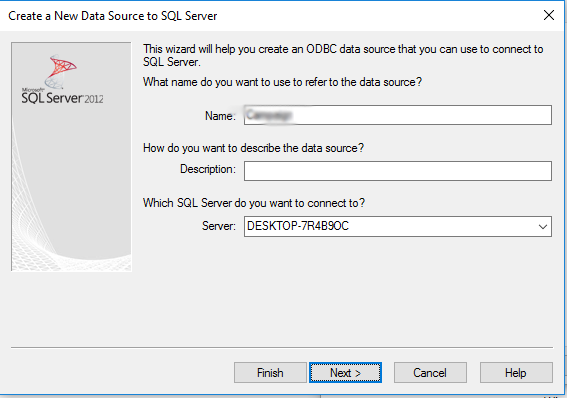
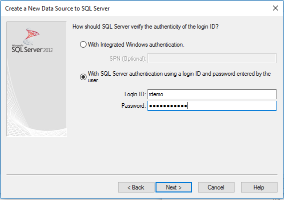
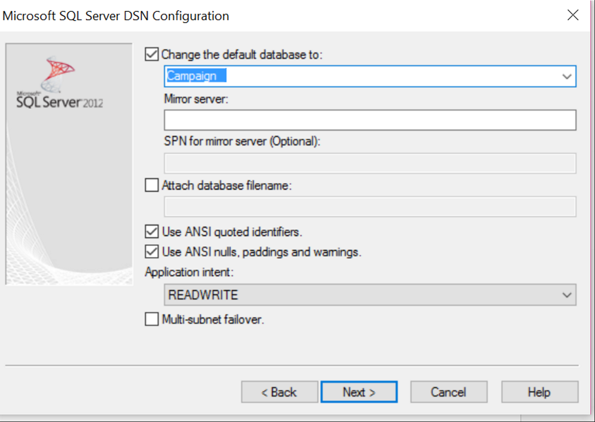
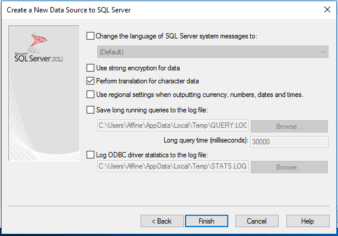
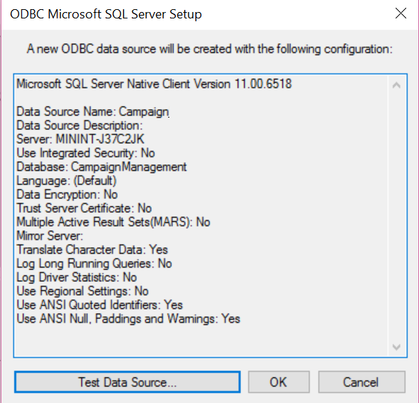
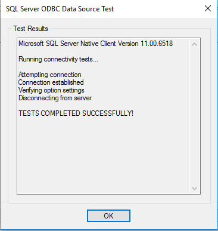
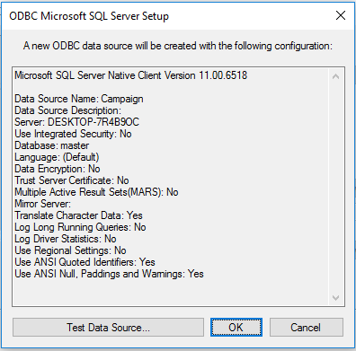
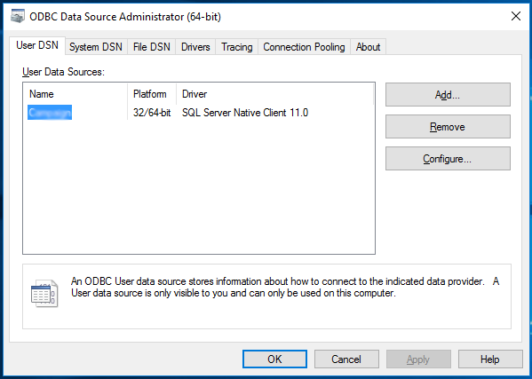

<h2>Set up Connection between SQL Server and PowerBI  </h2>

Follow the instructions below to set up a connection between your SQL Server database and PowerBI.  Perform these steps after you have created the <code>{{ site.db_name }}</code> database.

<ol>
<li>	Push the <code>Windows</code> key on your keyboard</li>
<li>	Type <code>ODBC</code> </li>
<li>	Open the correct app depending on what type of computer you are using (64 bit or 32 bit). To find out if your computer is running 32-bit or 64-bit Windows, do the following:</li>
<ul><li>	Open System by clicking the <code>Start</code> button, clicking <code>Control Panel</code>, clicking <code>System and Maintenance</code>, and then clicking <code>System</code>.</li>
<li>.	Under System, you can view the system type</li></ul>
<li>	Click on <code>Add</code>
   

</li>
<li>	Select <code>Server Native Client 11.0</code> and click finish
    

 </li>
<li>	Under Name, Enter <code>{{ site.db_name }}</code>. Under Server enter the MachineName from the SQL Server logins set up section. Press <code>Next</code>.
    

</li>
<li>	Select <code>SQL Server authentication</code> and enter the credentials you created in the SQL Server set up section. Press <code>Next</code>
    

</li>
 

<li>	Check the box for <code>Change the default database to</code> and enter <code>{{ site.db_name }}</code>. Press 
<code>Next</code>.
    

</li>
<li>Press <code>Finish</code>
   
 
</li>
<li>Press <code>Test Data Source</code>
   

</li> 
<li>	Press <code>OK</code> in the new popover. This will close the popover and return to the previous popovers.
    

</li>
<li>	Now that the Data Source is tested. Press <code>OK</code>
    

</li>
<li>	Finally, click <code>OK</code> and close the window 
    

</li>
</ol>

You are now ready to use this connection in PowerBI by following the [instructions here](Visualize_Results.html).
	