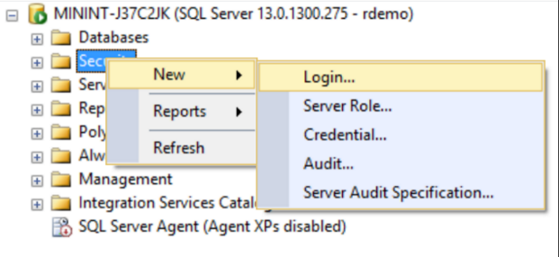
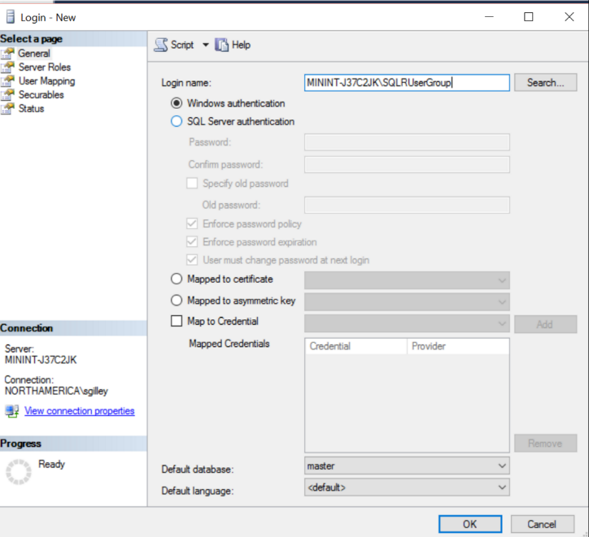
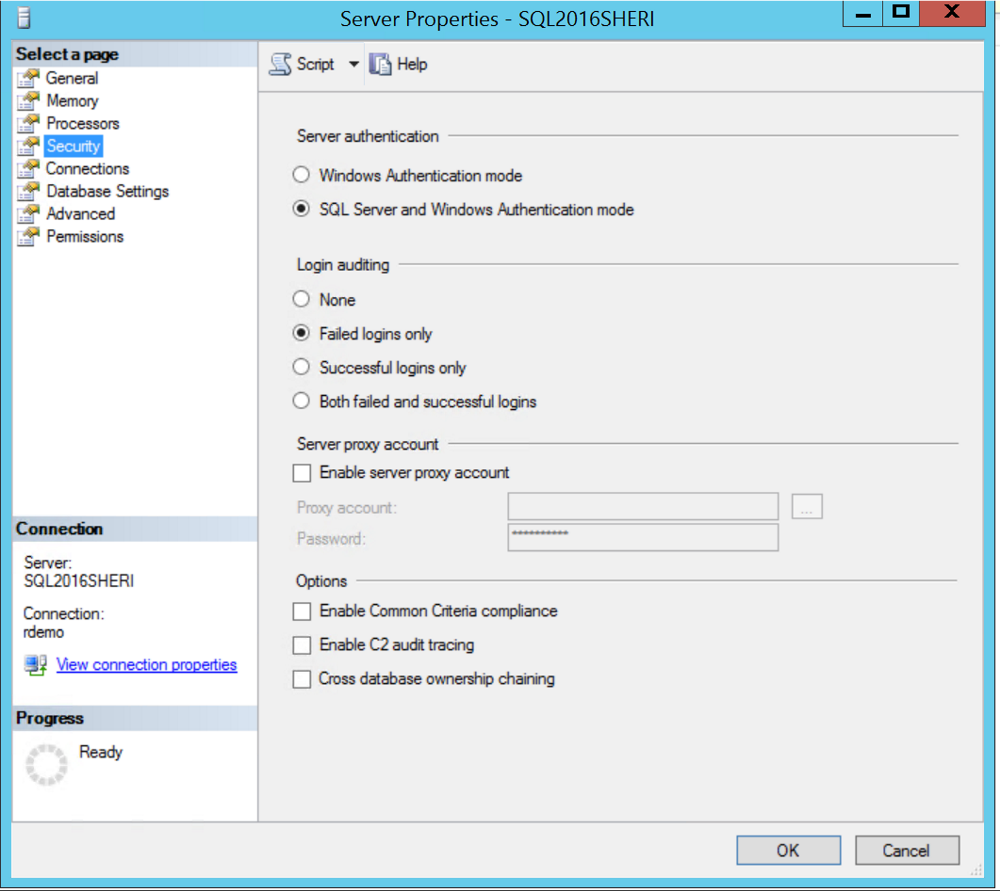

## On-Prem: Setup SQL Server 2016 
--------------------------

    

        

            <li><a href="#prepare-your-sql-server-2016-installation">Prepare your SQL Server 2016 Installation</a></li>
            <li><a href="#set-up-logins-in-sql-server">Set up logins in SQL Server</a></li>
            <li><a href="#ready-to-run-code">Ready to Run Code</a></li>
        

    

    

        The instructions on this page will help you to add this solution to your on premises SQL Server 2016.  
        

        If you instead would like to try this solution out on a virtual machine, visit the <a href="{{ site.aka_url }}">Cortana Intelligence Gallery</a> and use the Deploy button.  All the configuration described below will be done for you, as well as the initial deployment of the solution. 

    

## Prepare your SQL Server 2016 Installation
-------------------------------------------

The rest of this page assumes you are configuring your on premises SQL Server 2016 for this solution.

If you need a trial version of SQL Server 2016, see [What's New in SQL Server 2016](https://msdn.microsoft.com/en-us/library/bb500435.aspx) for download or VM options. 

Complete the steps in the Set up Microsoft Machine Learning Services (In-Database) Instructions. The set up instructions file can found at  <a href="https://msdn.microsoft.com/en-us/library/mt696069.aspx" target="_blank"> https://msdn.microsoft.com/en-us/library/mt696069.aspx</a>

### Set up logins in SQL Server
If you are administering your own server and want to add a user to run the code of this solution, use the steps below.

1.	In SSMS, connect to the Server with your admin account.
2.	Create a new user: Right click on <code>Security</code> and select <code>New &gt; Login.</code>  
     
    

 
3.	If you haven’t already done so, create a new Windows authentication user with the Login name <code>&lt;machinename&gt;/SQLRUserGroup</code>. 
    
    To find your computer name - Click the <code>Start</code> button, right-click <code>Computer</code>, and then click <code>Properties</code>. Under Computer name, domain, and workgroup settings, you can find your computer name and full computer name if your computer is on a domain.
     
    
 
4. Double click on **Resources/exampleuser.sql** file to see how to create a user with all the correct settings to execute R code. (This user login will be used to install data and procedures). Change the username and password to the one you wish to use before executing this query.

5. 	Check to make sure you have set your Server Authentication mode to SQL Server and Windows Authentication mode. 
    *	In SQL Server Management Studio Object Explorer, right-click the server, and then click <code>Properties</code>.
    *	On the Security page, under Server authentication, select <code>SQL Server and Windows Authentication mode</code> if it is not already selected.
     
    
    *	In the SQL Server Management Studio dialog box, click OK.  If you changed the mode in the previous step, you will need to also acknowledge the requirement to restart SQL Server.
    * If you changed the mode, restart the server.  In the Object Explorer, right-click your server, and then click <code>Restart</code>. If SQL Server Agent is running, it must also be restarted.

6.	Now, click on `File` on the top left corner of the SQL Server window and select `Connect Object Explorer…` verify that you can connect to the server with the username and password you created using the SQL Server Authentication.

### Ready to Run Code 
---------------------

You are now ready to run the code for this solution.  

* Typically a data scientist will create and test a predictive model from their favorite R IDE, at which point the models will be stored in SQL Server and then scored in production using Transact-SQL (T-SQL) stored procedures. 
You can follow along with this by following the <a href="Typical.html">Typical Workflow Walkthrough.</a>.

* If you’re just interested in the outcomes of this process, we have created a fully automated solution that loads the data in the database, trains and scores the models and provides prediction scores by executing a PowerShell script. This is the fastest way to deploy on your own machine. See <a href="Powershell_Instructions.html">PowerShell Instructions</a> for this deployment.
	