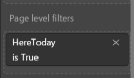
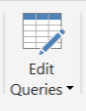
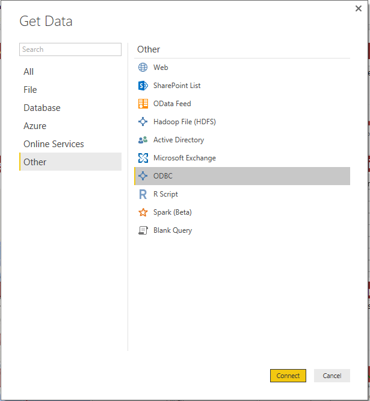
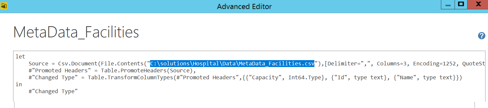
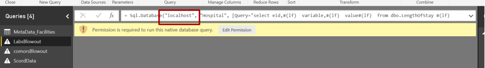
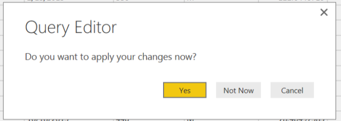
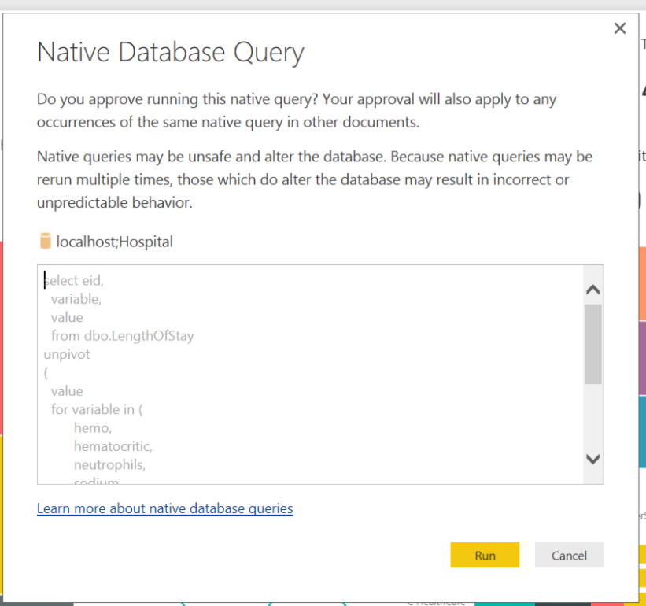
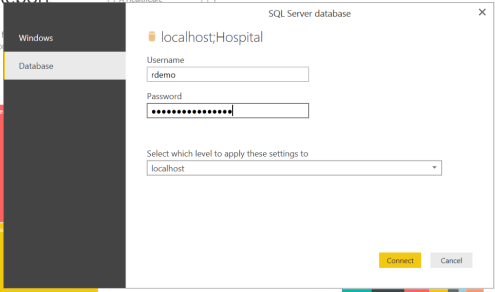
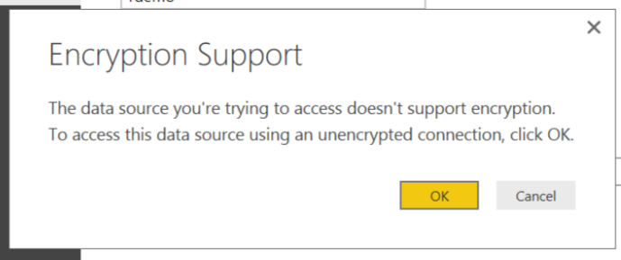

## Visualizing Results with PowerBI
-----------------------------------

This page explains how the data in PowerBI is filtered to show "today's" patient population, and shows how to update the cached data with data from your SQL Server. 

### Dashboard Details

This dashboard uses data for the five facilities over the course of a year. For planning purposes, there would be new data incoming each day.  We have simulated this in the current file by selecting a date in our static daa to represent "today".  The variable `ScoredData[Today]` represents this arbitrary date: `Today = DATEVALUE("7/1/2015")`. If you were instead using live data, the calculation would use the TODAY() function: `Today = TODAY()`.

Once `Today` has been created, a second variable is calculated.  A patient is in the hospital today if they have been admitted and have not yet been discharged:  `HereToday = ([admitdt] < [Today] ) && ([dischargedt] > [Today])`. 

Finally, the dashboard pages are filtered to display only data for patients that are here today.
  
 

### Configure PowerBI to Access Data 
In order to replace the cached data with data from your SQL Server, follow the steps below.

1.	Open the `{{ site.pbi_name }}` file in the {{ site.folder_name }} folder. Click on `Edit Queries` in the toolbar.  
  
 

2.	In the Query Editor, with the first Query selected (Metadata_Facilities), click on the `Advanced Editor`.
  
 

3. In the dialog, replace the pathname with the the path from your computer.  If you are on a VM deployed from Cortana Intelligence Gallery, replace the user name with the name you used to login to the VM. Click `Done` on the dialog.
  
 

 3. If you are connecting to a SQL Server on a different machine, replace "localhost" with the server IP address in the next three queries.  For now, ignore the permission alerts.
 

4.	9.	Next, click on `Close` and `Apply`. If prompted, select `Yes`.
  
 

5.	You may be prompted one or more times for permission to Run Native Database Queries. If you don't see this, select `Refresh` in the Dashboard window.
  
  

6.	Once you see the Run Native Database Queries, select `Run`.    
  
  

7.	If prompted to login, select Database in the dialog and enter your login details.  (The default if you have not changed it is user `rdemo`, password `D@tabase`).
  
  

8. Finally select `OK` to the encription alert.
  
 

9.	You may see more than on of the Run Database Queries dialogs.  Continue to select `Run` on each; you will no longer have to supply login information.

10.  You are now viewing data from your SQL Database, rather than the imported data that was part of the initial solution package.  Updates from the SQL Database will be reflected each time you hit `Refresh`. 

[&lt; Home](index.html)