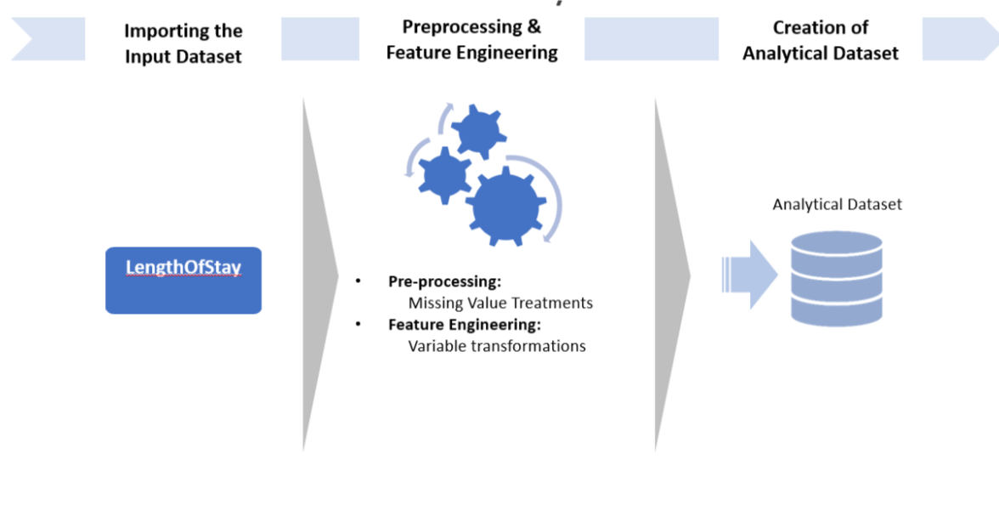
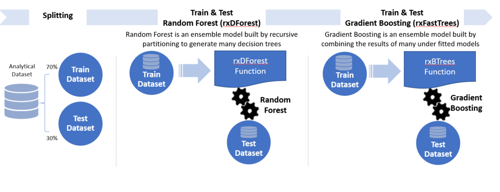

## For the Data Scientist
----------------------------

    

        

            <li><a href="#first">{{ site.solution_name }}</a></li>
            <li><a href="#system-requirements">System Requirements</a></li>
            <li><a href="#step1">Step1: Pre-Processing and Cleaning</a></li>
            <li><a href="#step2">Step2: Feature Engineering</a></li>
            <li><a href="#step3r">Step3: Splitting, Training, Testing and Evaluating</a></li>
             <li><a href="#step4">Deploy and Visualize Results</a></li>
            <li><a href="#template-contents">Template Contents</a></li>
        

    

    

        SQL Server R Services takes advantage of the power of SQL Server and RevoScaleR (Microsoft R Server package) by allowing R to run on the same server as the database. It includes a database service that runs outside the SQL Server process and communicates securely with the R runtime. 
        

       This solution package shows how to pre-process data (cleaning and feature engineering), train prediction models, and perform scoring on the SQL Server machine. 

    

Data scientists who are testing and developing solutions can work from the convenience of their R IDE on their client machine, while <a href="https://msdn.microsoft.com/en-us/library/mt604885.aspx">setting the computation context to SQL</a> (see **R** folder for code).  They can also deploy the completed solutions to SQL Server 2016 by embedding calls to R in stored procedures (see **SQLR** folder for code). These solutions can then be further automated by the use of SQL Server Integration Services and SQL Server agent: a PowerShell script (.ps1 file) automates the running of the SQL code.

## {{ site.solution_name }}
--------------------------

In order for hospitals to optimize resource allocation, it is important to predict accurately how long a newly admitted patient will stay in the hospital.

In this template, we implemented all steps in SQL stored procedures: data preprocessing, and feature engineering are implemented in pure SQL, while data cleaning, and the model training, scoring and evaluation steps are implemented with SQL stored procedures calling R (Microsoft R Server) code. 

All these steps can be executed in an R IDE. 

Among the key variables to learn from data are number of previous admissions as well as various diagnostic codes and lab results.  (View the [full data set description.](input_data.html) )

In this template, the final scored data is stored in SQL Server -  (`Boosted_Prediction`) model.  This data is then visualized in PowerBI. 

To try this out yourself, see the [Quick Start](START_HERE.html) section on the main page.  

This page describes what happens in each of the steps: dataset creation, model development, prediction, and deployment in more detail.

## System Requirements
--------------------------

To run the scripts requires the following:

- SQL Server 2016 with Microsoft R Server  (version 9.0.1) installed and configured.     
- The SQL user name and password, and the user configured properly to execute R scripts in-memory;
- SQL Database which the user has write permission and execute stored procedures;
- For more information about SQL server 2016 and R service, please visit: [https://msdn.microsoft.com/en-us/library/mt604847.aspx](https://msdn.microsoft.com/en-us/library/mt604847.aspx)

##  Step1: Pre-Processing and Cleaning
-------------------------

In this step, the raw data is loaded into SQL in a table called `LengthOfStay`. Then, if there are missing values, the data is cleaned in-place. This assumes that the ID variable (eid) does not contain blanks. 
There are two ways to replace missing values:

* The first provided function, `fill_NA_explicit`, will replace the missing values with "missing" (character variables) or -1 (numeric variables). It should be used if it is important to know where the missing values were.

* The second function, `fill_NA_mode_mean`, will replace the missing values with the mode (categorical variables) or mean (float variables).

The user can run the one he prefers. 

### Input:
* Raw data **LengthOfStay.csv**.

### Output:
* A SQL Table `LengthOfStay`, with missing values replaced.

### Related files:
* **step1_data_preprocessing.R**

## Step2: Feature Engineering
-------------------------

In this step, we design new features:  

* The continuous laboratory measurements (e.g. `hemo`, `hematocritic`, `sodium`, `glucose` etc.) are standardized: we substract the mean and divide by the standard deviation. 
* `number_of_issues`: the total number of preidentified medical conditions.

### Input:

* `LengthOfStay` table.

### Output:

* `LoS` table containing new features.

### Related files:

* **step2_feature_engineering.R**

## Step3:  Splitting, Training, Testing and Evaluating (Regression)
-------------------------

In this step, we split the data into a training set and a testing set. The user has to specify a splitting percentage. For example, if the splitting percentage is 70, 70% of the data will be put in the training set, while the other 30% will be assigned to the testing set. The `eid` that will end in the training set are stored in the table `Train_Id`.  Then we train a regression Random Forest (rxDForest) and a gradient boosted trees model (rxFastTrees) on the training set. The trained models are uploaded to SQL if needed later. Finally, we score the trained models on the testing set, and then compute regression performance metrics.

### Input:

* `LoS` table.

### Output:

* Performance metrics and trained models.

### Related files:

* **step3_training_evaluation**

 

  
##  Step 4: Deploy and Visualize Results
--------------------------------

See [For the Business Manager](business_manager.html) for a description of the personas who will be interested in using these predictions to aid them in their jobs.

Explore the  [online version]({{ site.dashboard_url}}) of the dashboard.

## Template Contents 
---------------------

[View the contents of this solution template](contents.html).

To try this out yourself: 

* View the [Quick Start](START_HERE.html).

[&lt; Home](index.html)
