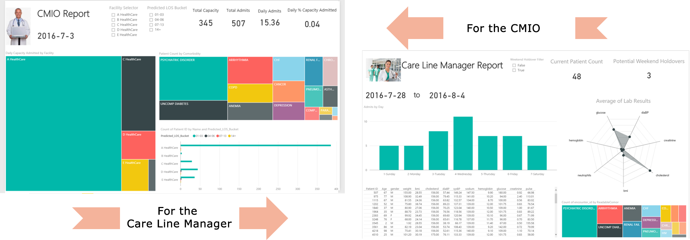

## For the Data Scientist
----------------------------

    

        

            <li><a href="#campaign-optimization">Campaign Optimization</a></li>
            <li><a href="#system-requirements">System Requirements</a></li>
            <li><a href="#analytical-dataset-preprocessing-and-feature-engineering">Analytical Dataset Preprocessing and Feature Engineering</a></li>
            <li><a href="#model-development">Model Development</a></li>
            <li><a href="#scoring">Scoring</a></li>
            <li><a href="#deploy-and-visualize-results">Deploy and Visualize Results</a></li>
            <li><a href="#template-contents">Template Contents</a></li>
        

    

    

        SQL Server R Services takes advantage of the power of SQL Server and RevoScaleR (Microsoft R Server package) by allowing R to run on the same server as the database. It includes a database service that runs outside the SQL Server process and communicates securely with the R runtime. 
        

        XXXREVIEW THIS: This solution package shows how to pre-process data (cleaning and feature engineering), train prediction models, and perform scoring on the SQL Server machine. 

    

Data scientists who are testing and developing solutions can work from the convenience of their R IDE on their client machine, while <a href="https://msdn.microsoft.com/en-us/library/mt604885.aspx">setting the computation context to SQL</a> (see **R** folder for code).  They can also deploy the completed solutions to SQL Server 2016 by embedding calls to R in stored procedures (see **SQLR** folder for code). These solutions can then be further automated by the use of SQL Server Integration Services and SQL Server agent: a PowerShell script (.ps1 file) automates the running of the SQL code.

## {{ site.solution_name }}
--------------------------

This template is focused on XXXDESCRIBE HIGH LEVEL WHAT THIS DOES. 

Among the key variables to learn from data are XXXDESCRIBE.  

In this template, the final scored database table in SQL Server XXXDESCRIBE IT HERE. This data is then visualized in PowerBI. XXXDESCRIBE WHAT YOU SEE IN POWERBI.

To try this out yourself, see the [Quick Start](START_HERE.html) section on the main page.  

This page describes what happens in each of the steps: dataset creation, model development, recommendations, and deployment in more detail.

## System Requirements
--------------------------

To run the scripts requires the following:

- SQL Server 2016 with Microsoft R server installed and configured.     
- The SQL user name and password, and the user configured properly to execute R scripts in-memory;
- SQL Database which the user has write permission and execute stored procedures;
- For more information about SQL server 2016 and R service, please visit: [https://msdn.microsoft.com/en-us/library/mt604847.aspx](https://msdn.microsoft.com/en-us/library/mt604847.aspx)

##  Analytical Dataset Preprocessing and Feature Engineering
-----------------------------------------------------------

This part simulates input data and performs preprocessing and feature engineering to create the analytical dataset. 
The **R** code to perform these steps can be run from an R client with the following scripts:

### step1_data_processing.R

This script XXXDESCRIBE

## Model Development
--------------------

XXXDESCRIBE

##  Scoring
--------------

XXXDESCRIBE

  
##  Deploy and Visualize Results
--------------------------------

XXXDESCRIBE

Explore the  [online version]({{ site.dashboard_url}}) of the dashboard.

## Template Contents 
---------------------

[View the contents of this solution template](contents.html).

To try this out yourself: 

* View the [Quick Start](START_HERE.html).

[&lt; Home](index.html)
